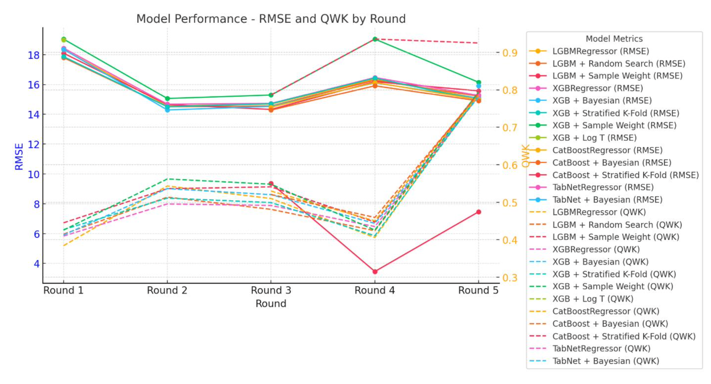

# Kaggle Data Mining Project: Problematic Internet Use & Physical Activity

## 📌 Overview
This project was part of a **graduate-level course**, where we participated in the [Kaggle competition](https://www.kaggle.com/competitions/child-mind-institute-problematic-internet-use).  
The goal was to **predict problematic internet usage in children and adolescents** based on their physical activity data.

## 🏆 Performance
- **Public Score:** 0.372  
- **Leaderboard 1st Place Score:** 0.482 (Overall, the prediction task was quite challenging.)

<p align="center">
  
</p>

## 🏫 Team & Contributions
This project was conducted by a team of **four graduate students**, including myself and three members from the **Data Mining Lab**.  
- **DainPixel**: Model training & hyperparameter tuning  
- **Team Members**: Outlier detection, PCA, feature selection, and missing value handling  

## 📊 Dataset Description
The dataset comes from the **Healthy Brain Network (HBN) study** and includes **physical activity data** (accelerometer & fitness assessments) and **internet usage behavior** (Severity Impairment Index - `sii`).

🔹 **Dataset Access:**  
The competition follows a **Code Competition format**, meaning the test set is hidden.  
The dataset can be downloaded from **[Kaggle](https://www.kaggle.com/competitions/child-mind-institute-problematic-internet-use)**.

## 🔧 Key Approaches
### **📌 Data Processing & Feature Engineering**
- **Baseline Models**: Logistic Regression, Random Forest  
- **Feature Engineering**: PCA, kNN-based pattern detection  
- **Time-Series Data**: Actigraphy integrated (but high missing values limited effectiveness)  
- **Handling Missing Data**: Semi-supervised learning (Multi-View)  
- **Class Imbalance Handling**: SMOTE, CTGAN, Stratified K-Fold  

### **📌 Model Selection & Training**
Initially, we approached this as a **classification problem**, testing standard classifiers such as:  
- **Random Forest, XGBoost, LGBM (Classifier Mode)**  

However, since the `sii` target variable provided continuous values, we later **switched to regression models**, applying:  
- **LGBM Regressor, XGBoost Regressor, CatBoost, TabNet**  

### **📌 Hyperparameter Tuning**
To optimize model performance, we experimented with various hyperparameter tuning strategies:  
- **Random Search** → Fast and effective for initial tuning  
- **Bayesian Optimization** → Used for fine-tuning key models (LGBM, XGBoost)  
- **Grid Search** (for final parameter refinement)  

## 🏁 Final Results
- **The best-performing model excluded actigraphy data** due to excessive missing values.  
- **Feature engineering and hyperparameter tuning improved results**, but the challenge remained.  
- **Ensemble learning & PCA** yielded the best overall performance.  

## 📂 Files
- `notebook-final-1.ipynb`: Jupyter Notebook containing model training and evaluation  
- `data/`: Processed dataset used for training (must be downloaded from Kaggle)  

## 🚀 How to Run
```sh
jupyter notebook notebook-final-1.ipynb
